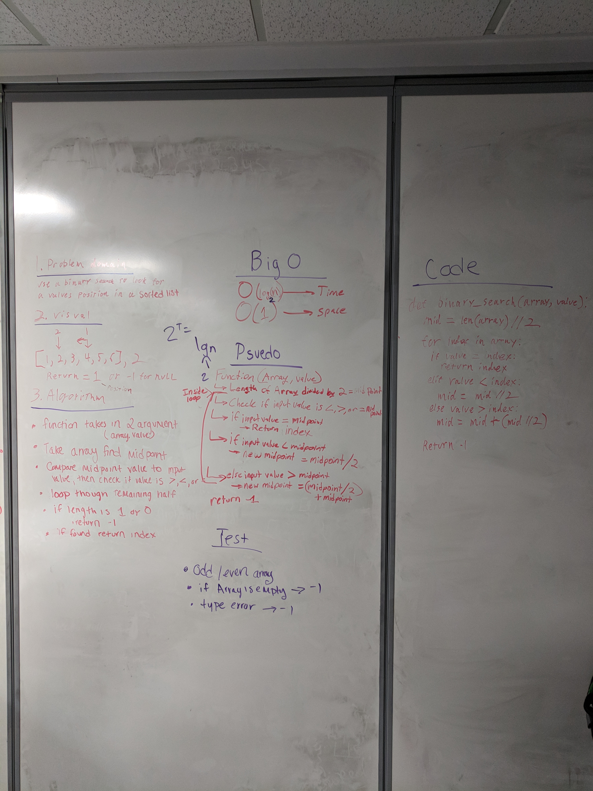

# Challenge 03 / Array Binary Search

## Problem Domain
- Use a binary search method to look for a values position in a sorted list.
- Do not use built in methods.

## Visual
- [1,2,4,5], 3 <-Input
- 2  <-Result

## Algorithm
- Function takes in two arguments
- First parameter is an array.
- Second parameter is a value.
- Determine midpoint of array.
- Compare midpoint to input value.
- If midpoint = to value, return index.
- If value < midpoint set midpoint to midpoint / 2
- If value > midpoint set midpoint to midpoint + (midpoint / 2)
- loop through if statements till value found or reaches 0
- if 0 return -1

## Pseudo Code
```
function(array, value)
  Length of array divided by 2 = midpoint
  set for loop
  check if input is <, >, or = to midpoint
  if input = midpoint return index
  if input > midpoint + (midpoint / 2)
  out of loop return -1
```

## Code
```
def binary_search(array, value):
  '''
  Use a binary search method to look for a values position in a sorted list.
  '''
  left = 0
  right = len(array) - 1
  while(left <= right):
    mid = (left + right) // 2
    if array[mid] is value:
      print(mid)
      return mid
    elif value < array[mid]:
      right = mid - 1
    elif value > array[mid]:
      left = mid + 1

  print(-1)
  return -1
```

## Big 'O'
- array_binary_search
 - Time: O(log2N)
 - Space: O(1)

## Whiteboard
Inline-style: 
