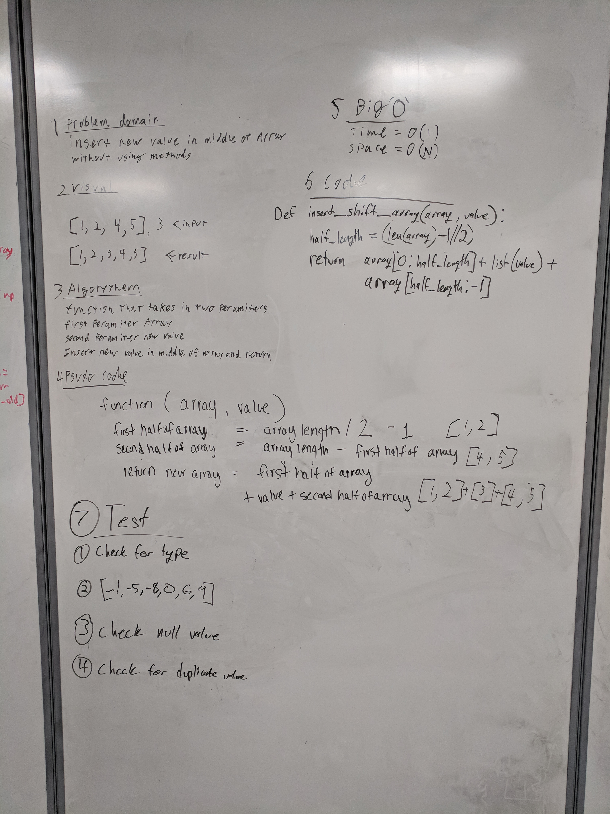

# Challenge 02 / Array Shift

## Problem Domain
- Insert a value in the middle of an array.
- Without using methods.

## Visual
- [1,2,4,5], 3 <-Input
- [1,2,3,4,5]  <-Result

## Algorithm
- Function that takes in two paramiters.
- First parameter is an array.
- Second parameter is a value.
- Insert value into middle of array.

## Pseudo Code
```
function(array, value)
  first half of array = array length / 2 -1
  second half of array = array length - first half of array
  return new array = first half of array + value + second half of array
```

## Code
```
def insertShiftArray(array, value):
  half = len(array)//2
  return array[:half] + [value] + array[half:]
```

## Big 'O'
- reverse_array
 - Space: O(1)
 - Time: O(N)

## Whiteboard
Inline-style: 
