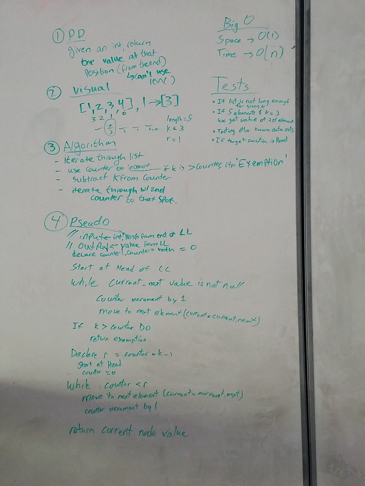

# ll_kth_from_end

 k-th value from the end of a linked list. 

## Challenge

Write a method for the Linked List class which takes a number, k, as a parameter. Return the node that is k from the end of the linked list. You have access to the Node class and all the properties on the Linked List class as well as the methods created in previous challenges. 

## Solution


**Authors**: Chris L Chapman, Madeline Peters, Steph Harper, Nick Damberg

### Features Checklist

- [ ] Create a branch in your repository called ll_kth_from_end
- [ ] Python: Extend your LinkedList class according to the feature tasks below
- [ ] Include any language-specific configuration files required for this challenge to become an individual component, module, library, etc.
- [ ] Write a method for the Linked List class which takes a number, k, as a parameter.
- [ ] Return the node that is k from the end of the linked list. You have access to the Node class and all the properties on the Linked List class as well as the methods created in previous challenges. 
- [ ] Created and working in a branch titled as the challenge name
- [ ] Created a directory named according to the challenge name, import all starter files
- [ ] Whiteboard image placed in /assests directory with name matching the challenge
- [ ] Function name labeled according to instructions
- [ ] Prepare Checklist to use with assignment completion
- [ ] Write at least 3 test assertions
- [ ] Ensure code is passing all tests
- [ ] Update challenge Readme file with accurate info
- [ ] Update main repo Readme file with accurate info
- [ ] Utilize the Single-responsibility principle: any methods you write should be clean, reusable, abstract component parts to the whole challenge.
- [ ] Write at least three test assertions for each method that you define. 
- [ ] Ensure your tests are passing before you submit your solution. 

### Software
```
pipenv --three
pipenv shell
pipenv install pytest
```

## Whiteboard
Inline-style: 
