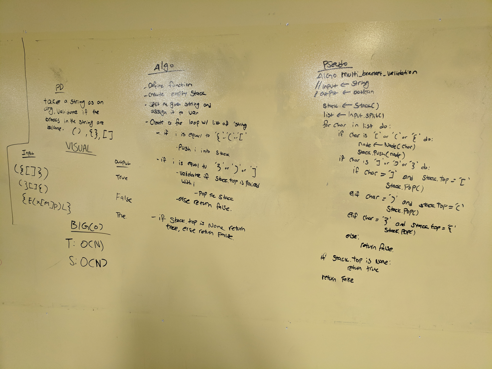

# Challenge 13 / multi_bracket_validation

## Problem Domain
- On your main file, create…
- Python: a function called multi_bracket_validation(input)
- Your function should take a string as its only argument, and should return a boolean representing whether or not the brackets in the string are balanced. There are 3 types of brackets:

- Round Brackets : ()
- Square Brackets : []
- Curly Brackets : {}

## Visual
- Input	                    Output
- {}	                    TRUE
- {}(){}	                TRUE
- ()[[Extra Characters]]	TRUE
- (){}[[]]	                TRUE
- {}{Code}[Fellows](())	    TRUE
- [({}]	                    FALSE
- (](	                    FALSE
- {(})	                    FALSE

## Algorithm
- 

## Pseudo Code
```

```

## Code
```

```

## Big 'O'
- reverse_array
 - Space: O(N)
 - Time: O(N)

## Whiteboard
Inline-style: 
