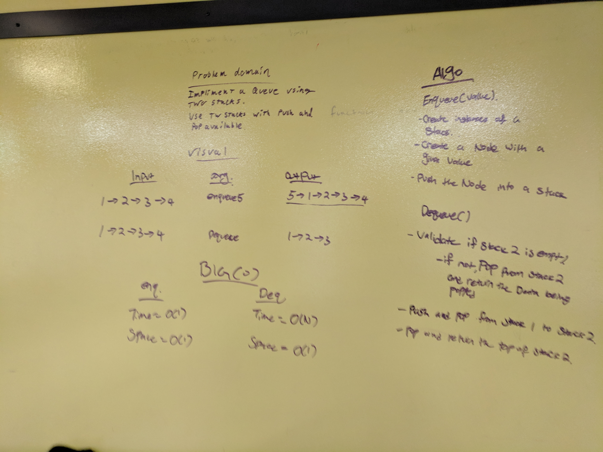

# Challenge 11 / queue_with_stacks

## Problem Domain
- a file called queue_with_stacks.py
- enqueue(value) which inserts value into the Queue using a first-in, first-out approach.
- dequeue() which extracts a value from the Queue using a first-in, first-out approach.
- You have access to 2 Stack instances with push and pop methods.

## Visual


## Algorithm


## Pseudo Code
```

```

## Code
```

```

## Big 'O'
- reverse_array
 - Space: O(1)
 - Time: O(N)

## Whiteboard
Inline-style: 
